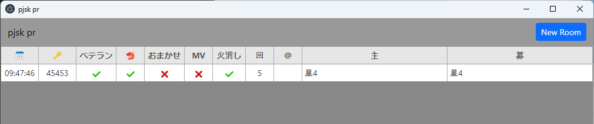
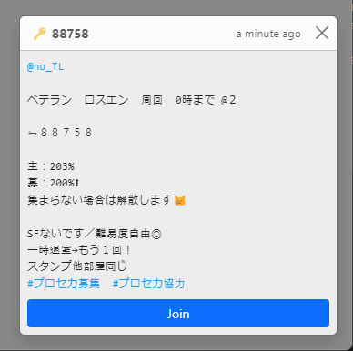
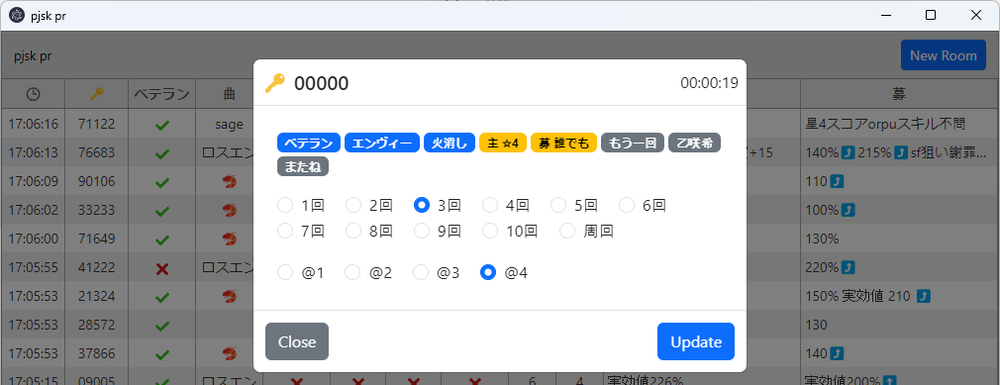
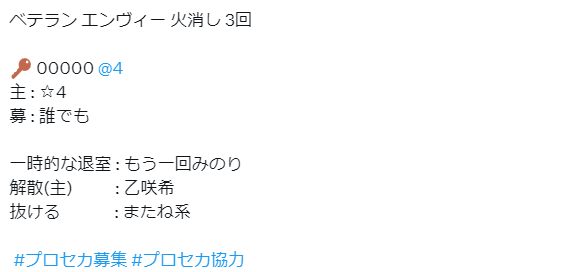
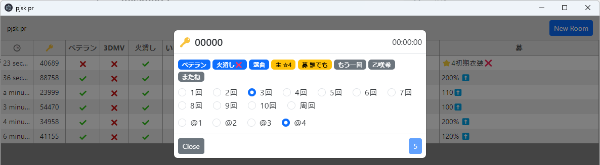
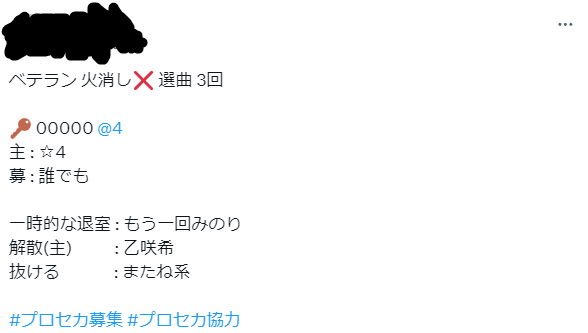

# pjsk-pr

Search for Project SEKAI public room from twitter.

  

## Features

- Search public rooms created in 1 hour.
- As a guest, you join public room and update room.
- Create a public room with simply settings.
- Update room created with this application.
- Show original content when mouse left click row.

  

  

  

  

  

## Fields

| Field | Description |
| --- | --- |
| 🕒 | Updated time | 
| 🔑 | Room ID | 
| ベテラン | Veteran Room | 
| 3DMV | Play 3DMV mode (Do not set default clothes) | 
| 火消し | Allow play for stamina empty (default value: true) | 
| いじぺち | AFK allowed after get S rank | 
| 曲 | Play only "選曲", "おまかせ", "独りんぼエンヴィー", "ロストエンファウンド", "sage" | 
| 回 | Number of plays remaining | 
| @ | Required number of players | 
| 主 | Host stat | 
| 募 | Guest stat | 

## Usage

Sign in to twitter. (need to once)

Create a room

1\. Click "New Room" button.
2\. Customize room settings.
3\. Click "Create" button.
4\. You can update required number of players and number of plays remaining.

Join room

1\. Wait until the room appears.
2\. Click row.
3\. Click "Join" button.
4\. You can update room with original content.

## Updates

- Add join button.
- Prevent duplicate updates.
- Change to preview modal from popup.