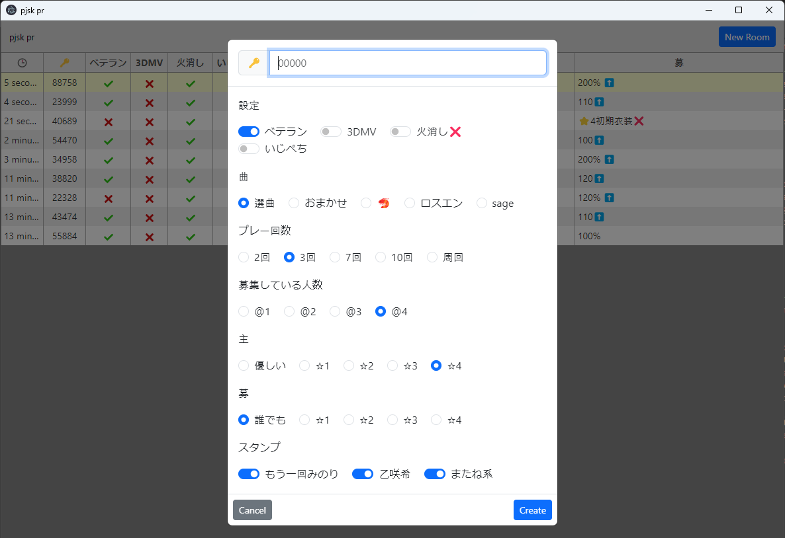

# pjsk-pr

Search for Project SEKAI public room from twitter.

  

## Features

- Search public rooms created in 1 hour.
- Highlight on updated room.
- Create a public room with simply settings.
- Update room created with this application.
- Show original content when left click row.

  

  

  

## Fields

| Field | Description |
| --- | --- |
| 🕒 | Time | 
| 🔑 | Room ID | 
| ベテラン | Veteran Room | 
| 曲 | Play only "選曲", "おまかせ", "独りんぼエンヴィー", "ロストエンファウンド", "sage" | 
| 3DMV | Play 3DMV mode (Do not set default clothes) | 
| 火消し | Allow play for stamina empty (default value:⭕) | 
| いじぺち | Allow AFK after get S rank | 
| 回 | Maximum count of play | 
| @ | Required number of players | 
| 主 | Host stat | 
| 募 | Guest stat | 

## Usage

1. Open "pjsk pr" application.
2. Sign in to twitter. (need to once)
3. Wait for loading or create a new room.
4. Play game and update room.

## updates

- Add ロスエン field.
- Fix img element parsing.
- Add resting time to collector.
- Add 曲 field.
- Remove 🦐, ロスエン, おまかせ fields.
- Fix stamp option.